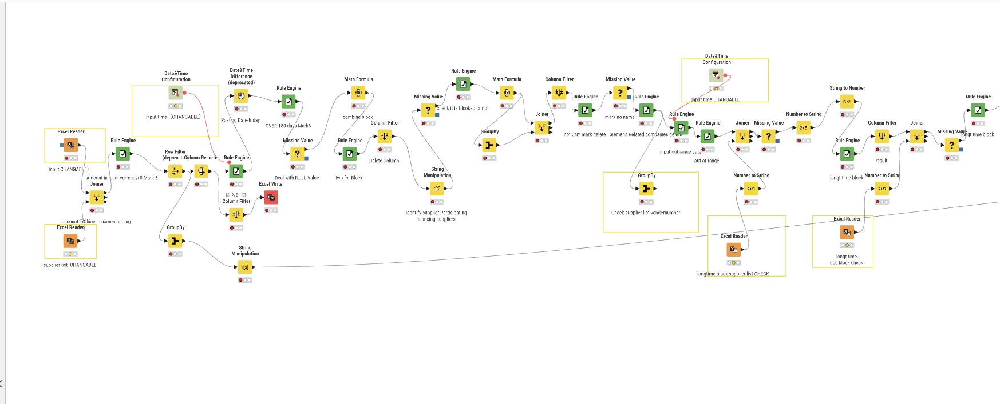
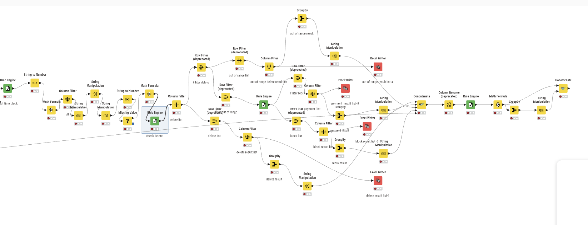

# KNIME-Based SAP Vendor Payment Workflow Automation

Vendor Payment Process Automation with KNIME

## Project Overview
This project showcases a KNIME-based automation workflow developed to streamline a recurring supplier payment preparation process based on SAP-exported Excel files.

Previously, each payment cycle required substantial manual Excel work, including filtering, lookup matching, exception checking, and splitting records into multiple output tables. Since the process followed a stable logic in each cycle, it was redesigned into an automated KNIME workflow.

The solution reduces processing time to approximately 5–10 minutes per cycle and improves consistency, repeatability, and transparency in finance operations.

## Business Context
The workflow supports periodic supplier payment preparation by identifying which invoices or suppliers should:
- be included in the current payment cycle
- be blocked from payment
- be excluded because they are not yet due
- be removed based on affiliated-company or supplier-category rules

This automation is designed for a repetitive finance operation where the same logic is applied regularly to SAP-exported files and supporting reference lists.

## Main Outputs
The workflow generates multiple result tables, including:
- Payment List
- Block List
- Out-of-Range / Not-Due List
- Delete / Exclusion List

## Supporting Reference Files
The workflow relies on a primary SAP payment export file and several supporting reference files to apply rule-based filtering and supplier classification logic. These files are maintained separately and updated periodically.

Examples include:
- weekly SAP-exported payment data
- supplier master list
- blocked supplier list
- affiliated company reference list
- supplier financing participation list
- long-term block / document control list
- special supplier category lists

## Workflow Logic
The workflow generally follows this process:
1. Read SAP-exported source data
2. Import supplier and control reference files
3. Apply rule-based flags and date logic
4. Match records through joins and lookups
5. Handle null values and data type conversions
6. Classify suppliers/invoices into payment categories
7. Export multiple result tables for operational use

## KNIME Nodes Used
This project mainly uses the following KNIME nodes:
- Excel Reader
- Excel Writer
- Rule Engine
- Row Filter
- Column Filter
- Column Resorter
- Joiner
- GroupBy
- Missing Value
- Math Formula
- String Manipulation
- String to Number
- Number to String
- Concatenate
- Column Rename
- Date&Time Configuration
- Date&Time Difference

## Business Impact
- Reduced manual Excel processing time to 5–10 minutes per cycle
- Improved process consistency and repeatability
- Replaced repetitive filtering and lookup operations with automated logic
- Supported recurring finance operations with structured output generation

## Workflow Overview

### Part 1

### Part 2

## Confidentiality Note
To protect data privacy and internal business information, this repository does not include original data files, internal reference lists, or production output files.

The workflow screenshots shared here are for demonstration purposes only and are intended to present the high-level automation logic rather than the full operational implementation.
